# CurveGuard

**AI-Powered Posture Wellness Platform**  

CurveGuard is a real-time posture monitoring platform that uses computer vision and AI to promote healthy spinal habits. Available as both a **web application** and **desktop app**, CurveGuard leverages [MediaPipe](https://mediapipe.dev/) for body landmark detection to alert users of poor posture. By encouraging upright sitting posture, CurveGuard aims to prevent long-term spinal issues such as **scoliosis**, **lordosis**, and **kyphosis**.

---

## Web Application

The web version of CurveGuard provides a modern, immersive 3D experience with cloud-powered posture tracking and analytics.

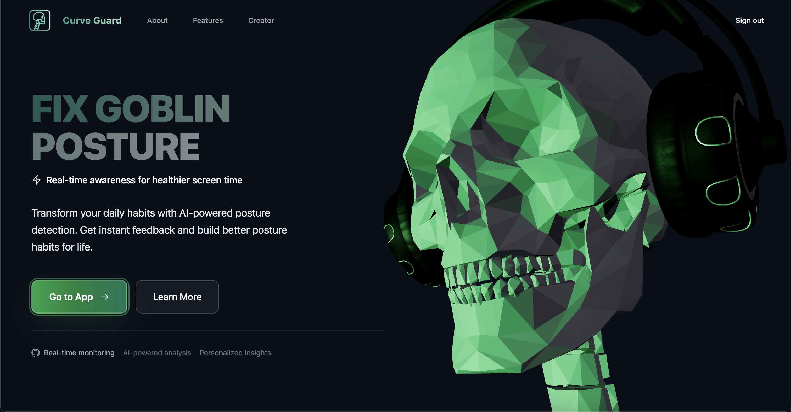

### Features

- **Interactive 3D Interface** - Stunning Three.js visualizations with a skeleton model that responds to your posture in real-time
- **Cloud-Powered Analytics** - Track your posture history and view detailed statistics over time
- **AWS Amplify Authentication** - Secure user accounts with data persistence
- **Responsive Design** - Works seamlessly across desktop and mobile browsers
- **Real-Time Detection** - Live posture feedback using MediaPipe Pose
- **Customizable Settings** - Adjust sensitivity, thresholds, and detection parameters
- **Visual Charts** - View your posture trends with interactive Chart.js graphs

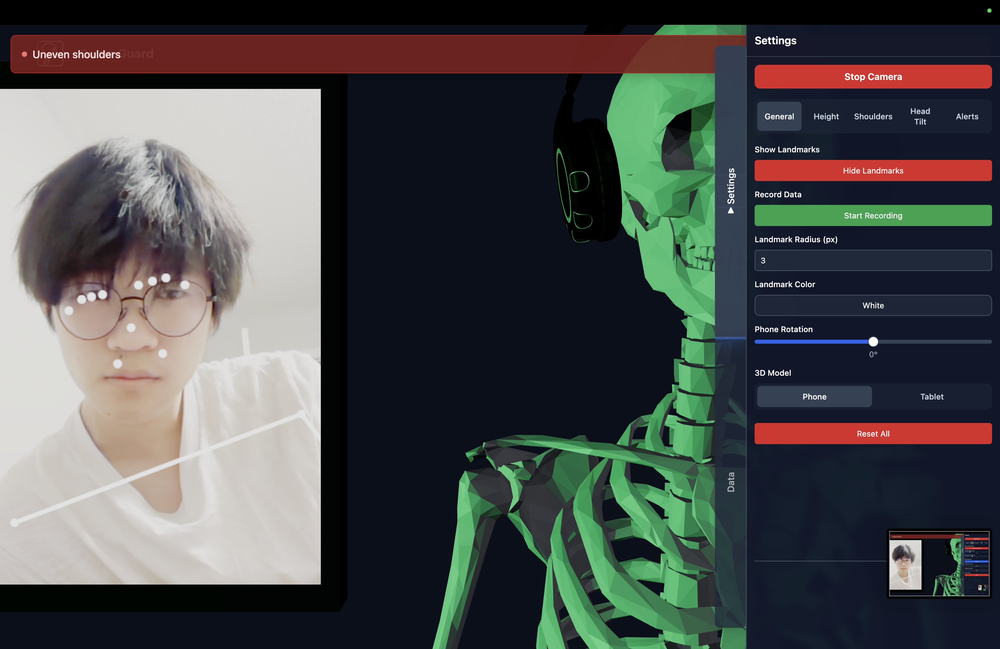

### Customizable Posture Metrics

The web application tracks multiple posture indicators with customizable thresholds:

#### Head Tilt Detection
Monitors head alignment to prevent forward head posture and neck strain.


#### Eye Height Tracking
Ensures proper eye level alignment with your screen for optimal viewing posture.

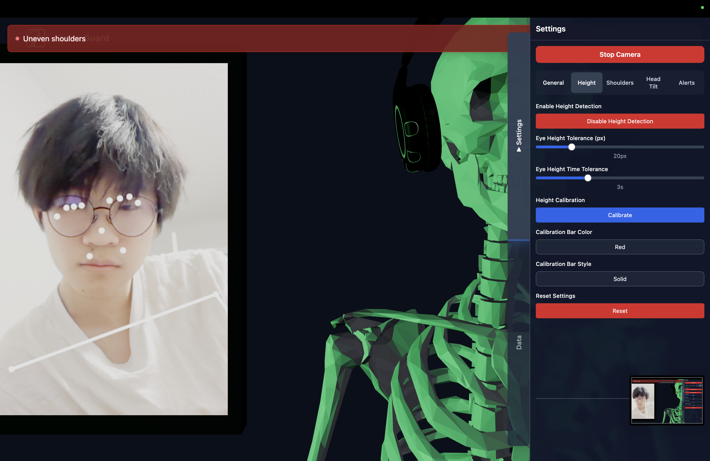

#### Shoulder Balance
Detects shoulder asymmetry to promote balanced sitting posture.

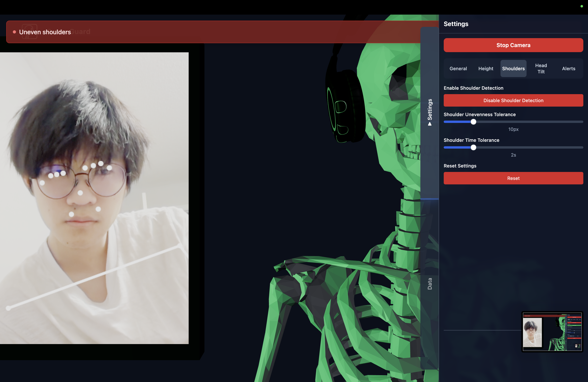

### Alerts and Notifications

Receive real-time alerts when poor posture is detected, with customizable sensitivity and timing.

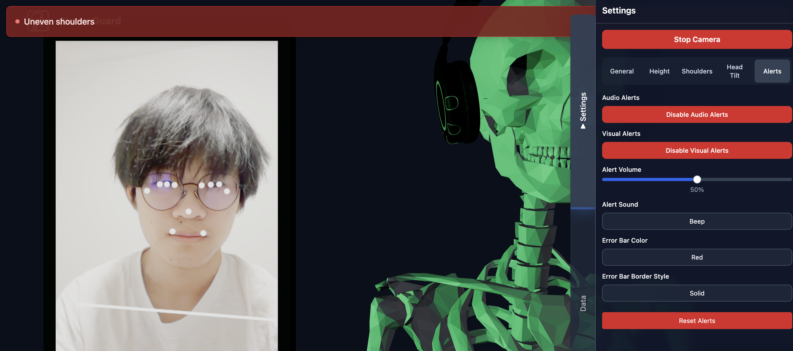

### Settings Panel

Comprehensive settings panel for fine-tuning detection parameters and preferences.

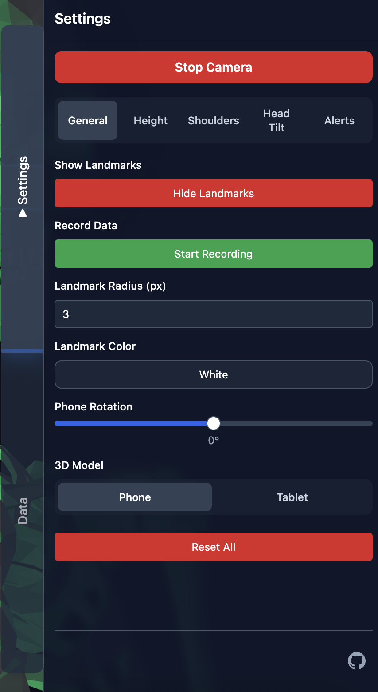

### Web Tech Stack

| Component | Technology |
|-----------|-----------|
| **Frontend Framework** | [React](https://react.dev/) + [Vite](https://vitejs.dev/) |
| **3D Graphics** | [Three.js](https://threejs.org/) + [React Three Fiber](https://docs.pmnd.rs/react-three-fiber/) |
| **Pose Detection** | [MediaPipe Pose](https://google.github.io/mediapipe/solutions/pose.html) |
| **UI Components** | [Radix UI](https://www.radix-ui.com/) |
| **Styling** | [Tailwind CSS](https://tailwindcss.com/) |
| **Animations** | [GSAP](https://greensock.com/gsap/) |
| **Charts** | [Chart.js](https://www.chartjs.org/) + React Chart.js 2 |
| **Backend** | [AWS Amplify](https://aws.amazon.com/amplify/) |
| **Routing** | [React Router](https://reactrouter.com/) |

### Getting Started (Web)

#### Prerequisites
- Node.js 16+ and npm/yarn
- AWS account (for deployment)

#### Installation

1. **Navigate to the client directory:**
   ```bash
   cd client
   ```

2. **Install dependencies:**
   ```bash
   npm install
   ```

3. **Start the development server:**
   ```bash
   npm run dev
   ```

4. **Open your browser:**
   Navigate to `http://localhost:5173`

### Analytics and Data Tracking

Track your posture improvement over time with detailed analytics:

#### Daily Statistics
View detailed daily posture metrics and trends.

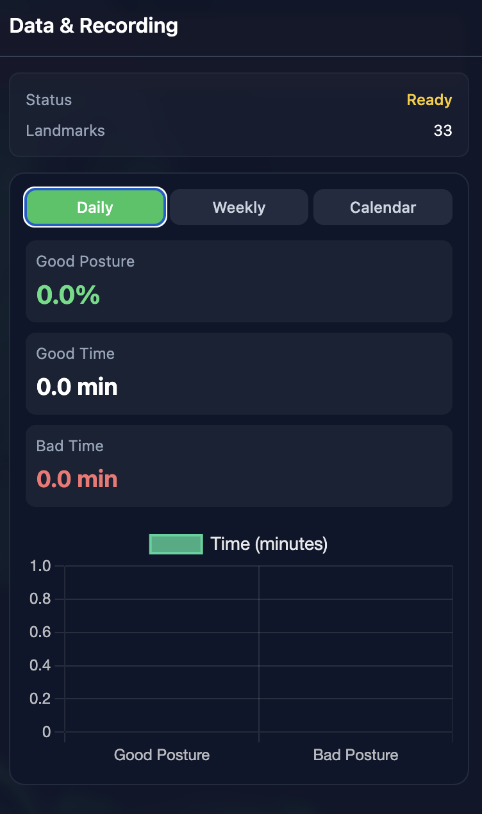

#### Weekly Overview
Analyze weekly patterns to understand your posture habits.


#### Calendar View
Navigate through your posture history with an intuitive calendar interface.

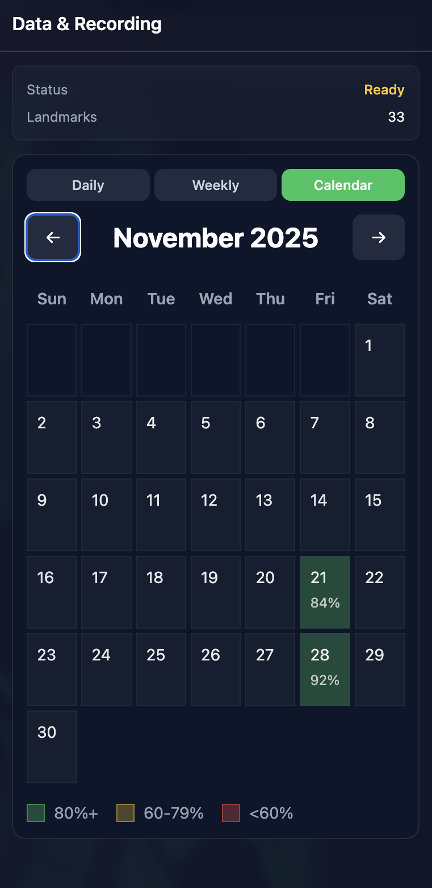

#### Feature Information
Learn about each posture metric and how it affects your health.

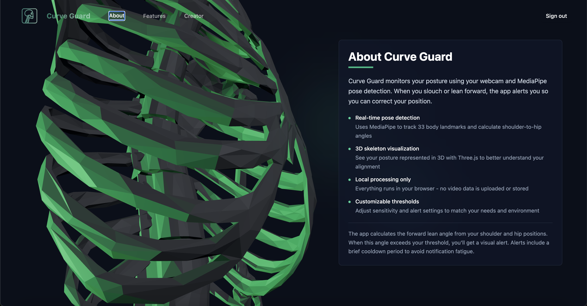

#### Creator Profile
About the developer and project information.

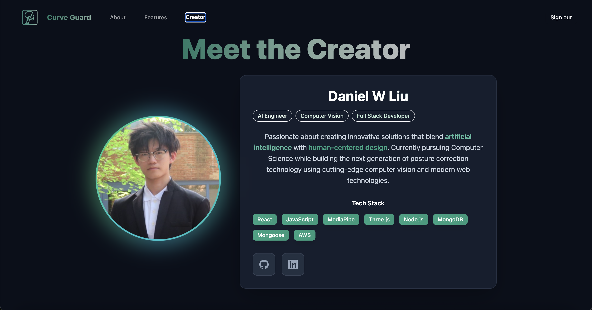

#### Features Overview
Explore all available features and capabilities.

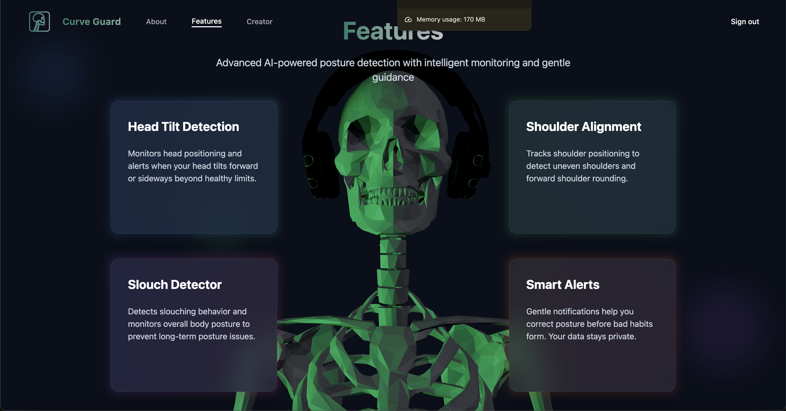

#### Deployment

Deploy to AWS Amplify:
```bash
npx ampx sandbox
```

For production deployment, follow the [AWS Amplify deployment guide](https://docs.amplify.aws/).

---

## Desktop Application

The desktop version provides a lightweight, standalone posture monitoring tool with a PyQt5 interface.


### Desktop Features

- **Non-invasive Tracking** - No wearables or sensors needed
- **Real-time Feedback** - Instant alerts on head tilt, shoulder slope, and back alignment
- **Adjustable Check Frequency** - Customize how often posture is evaluated
- **Lightweight GUI** - Simple PyQt5 interface for status and settings
- **Modular Design** - Extensible codebase for future enhancements

###  Posture Metrics Tracked

The desktop app monitors three key indicators of posture in real-time:

#### Eye Height Monitor
Users can calibrate an eye-level reference line to help ensure they sit upright while using their device. This calibration is based on **MediaPipe pose landmarks 2 and 3**, which correspond to the left and right eyes.

A demo of the calibration can be seen below:


The system allows customizable settings:
- **Calibrate**: Create a reference line based on the average eye positions (landmarks 2 and 3).
- **Leniency**: Set the number of pixels the eyes can fall below the reference line before triggering a warning.
- **Delay**: Define how many seconds the eyes must remain below the line before the system responds.
- **Visibility**: Enable visibility of the reference line.

This feature encourages better posture by helping users maintain consistent vertical alignment between their eyes and the screen.


#### Shoulder Slope Monitor
The shoulder slope monitor tracks whether a user's shoulders are level or slanted while sitting. It uses MediaPipe pose landmarks 11 and 12, which correspond to the left and right shoulders.

Customizable settings include:
- **Leniency**: Set the maximum vertical difference (in pixels) between the two shoulders.
- **Delay**: Set the number of seconds the shoulders must remain uneven before triggering a warning.
- **Visibility**: Enable visibility of highlighted shoulder landmarks.

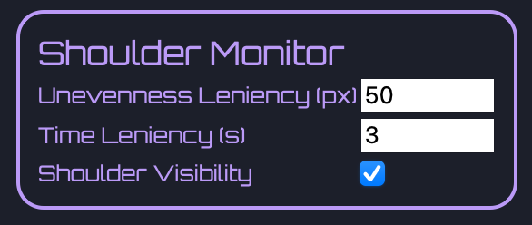

This promotes symmetrical posture and can help users avoid leaning or slouching over time.

#### Head Tilt Monitor
The head tilt monitor detects whether a user's head is tilted too far forward or sideways. It calculates the vertical difference between the left and right landmarks present on face.

Customizable settings include:
- **Leniency**: Set the maximum vertical difference (in pixels) before it's considered incorrect posture.  
- **Delay**: Set the number of seconds the head must remain tilted before triggering a warning.  
- **Visibility**: Enable visibility of the on-screen tilt guideline for real-time feedback.

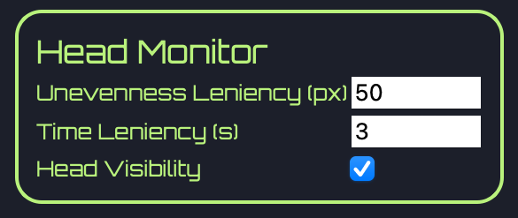

This feature helps reinforce neutral head alignment and reduce the risk of neck strain caused by prolonged poor posture.

### Desktop Tech Stack

| Component | Technology |
|-----------|-----------|
| **Pose Detection** | [MediaPipe Pose](https://google.github.io/mediapipe/solutions/pose.html) |
| **Computer Vision** | [OpenCV](https://opencv.org/) |
| **GUI Framework** | [PyQt5](https://riverbankcomputing.com/software/pyqt/) |
| **Programming Language** | Python 3.8+ |
| **Style** | Qt Stylesheets (`.qss`) |
| **Utilities** | NumPy, Python's `threading` module |

### Getting Started (Desktop)

#### Prerequisites
- Python 3.8+

#### Installation

1. **Navigate to the desktop directory:**
   ```bash
   cd desktop
   ```

2. **Install dependencies:**
   ```bash
   pip install -r requirements.txt
   ```

3. **Run the application:**
   ```bash
   python main.py
   ```

---

## Credits

### Asset Credits

This project uses the following CC-BY 3D assets:

- **"Free Pack – Human Skeleton"** by **PolyOne Studio**, licensed under **CC BY 4.0**.  
  Source: https://sketchfab.com/3d-models/free-pack-human-skeleton-xxxx

- **"Headphones Free Model"** by **OSCAR CREATIVO**, licensed under **CC BY 4.0**.  
  Source: https://sketchfab.com/3d-models/headphones-free-model-xxxx

Some assets have been modified from their originals.

---

## License

This project is licensed under the **MIT License**.

You are free to use, modify, and distribute this software for personal or commercial purposes, provided that you include the original copyright and license.

See the [LICENSE](LICENSE) file for full license text.
