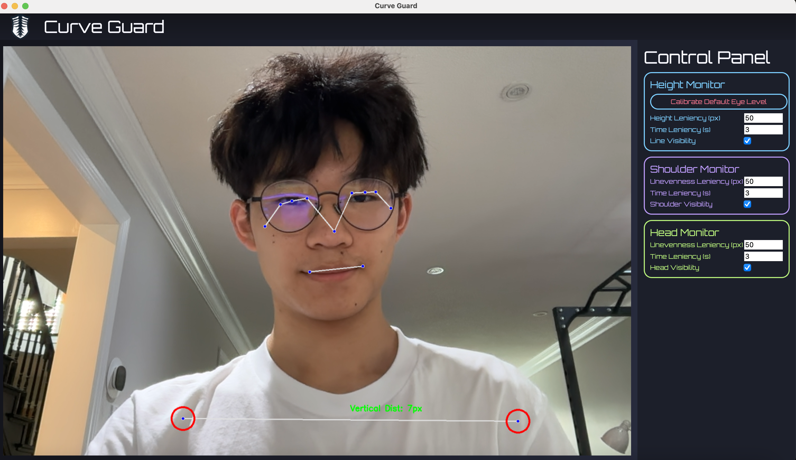

# CurveGuard

**Posture-aware wellness tool powered by AI**  
**CurveGuard** is a real-time posture monitoring desktop app that uses computer vision to promote healthy spinal habits. It leverages [MediaPipe](https://mediapipe.dev/) for body landmark detection and provides an intuitive PyQt5 interface to alert users of poor posture while using their computer. By encouraging upright sitting posture, CurveGuard aims to prevent long-term spinal issues such as **scoliosis**, **lordosis**, and **kyphosis**.




---

## Features

- 🔍 Non-invasive posture tracking (no wearables or sensors needed)
- 📐 Real-time feedback on head tilt, shoulder slope, and back alignment
- ⏱️ Adjustable posture check frequency
- 🪟 Lightweight PyQt5 GUI for status and settings
- 💾 Modular and extensible codebase for future features like stats/history tracking

---

##  Posture Metrics Tracked

CurveGuard monitors three key indicators of posture in real-time:

### Eye Height Monitor
Users can calibrate an eye-level reference line to help ensure they sit upright while using their device. This calibration is based on **MediaPipe pose landmarks 2 and 3**, which correspond to the left and right eyes.


The system allows customizable settings:
- **Calibrate**: Create a reference line based on the average eye positions (landmarks 2 and 3).
- **Leniency**: Set the number of pixels the eyes can fall below the reference line before triggering a warning.
- **Delay**: Define how many seconds the eyes must remain below the line before the system responds.
- **Visibility**: Enable visibility of the reference line.
This feature encourages better posture by helping users maintain consistent vertical alignment between their eyes and the screen.


### Shoulder Slope Monitor
The shoulder slope monitor tracks whether a user's shoulders are level or slanted while sitting. It uses MediaPipe pose landmarks 11 and 12, which correspond to the left and right shoulders.

Customizable settings include:

- **Leniency**: Set the maximum vertical difference (in pixels) between the two shoulders.
- **Delay**: Set the number of seconds the shoulders must remain uneven before triggering a warning.
- **Visibility**: Enable visibility of highlighted shoulder landmarks.


This promotes symmetrical posture and can help users avoid leaning or slouching over time.

### Head Tilt Monitor
The head tilt monitor detects whether a user's head is tilted too far forward or sideways. It calculates the vertical difference between the left and right landmarks present on face.

Customizable settings include:

- **Leniency**: Set the maximum vertical difference (in pixels) before it's considered incorrect posture.  
- **Delay**: Set the number of seconds the head must remain tilted before triggering a warning.  
- **Visibility**: Enable visibility of the on-screen tilt guideline for real-time feedback.


This feature helps reinforce neutral head alignment and reduce the risk of neck strain caused by prolonged poor posture.

---
## Tech Stack

| Component        | Technology                  |
|------------------|------------------------------|
| **Pose Detection** | [MediaPipe Pose](https://google.github.io/mediapipe/solutions/pose.html) |
| **Computer Vision** | [OpenCV](https://opencv.org/) |
| **GUI Framework**   | [PyQt5](https://riverbankcomputing.com/software/pyqt/) |
| **Programming Language** | Python 3.8+ |
| **Style** | Qt Stylesheets (`.qss`) |
| **Utilities** | NumPy, Python’s `threading` module |

---

## Installation

### Requirements

- Python 3.8+
- PyQt5
- OpenCV
- MediaPipe
- Numpy

Install dependencies:

```bash
pip install -r requirements.txt
```

## 📄 License

This project is licensed under the **MIT License**.

You are free to use, modify, and distribute this software for personal or commercial purposes, provided that you include the original copyright and license.

See the [LICENSE](LICENSE) file for full license text.
